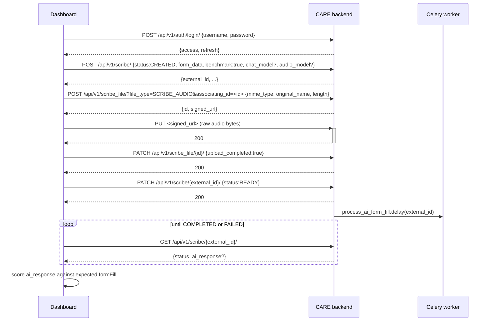
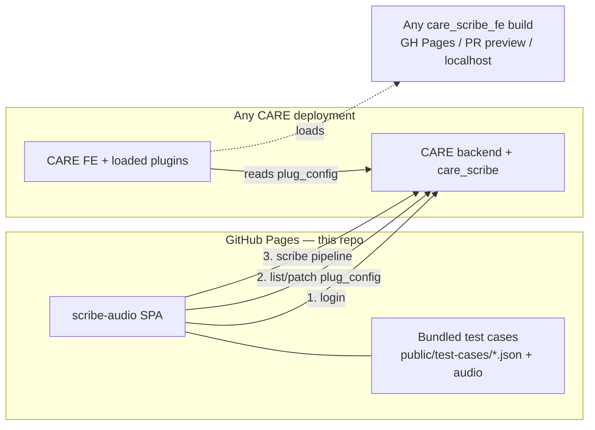

# scribe-audio — Plan

A standalone dashboard (hosted on GitHub Pages) that connects to any CARE deployment that has the `care_scribe` backend plugin installed, lets you swap the `care_scribe_fe` frontend plug URL for that deployment, and runs benchmark suites of pre-recorded audio against the scribe pipeline to score how well it fills forms / notes.

---

## 1. The four moving parts

| Repo | Type | Role |
|------|------|------|
| [`ohcnetwork/care`](https://github.com/ohcnetwork/care) | Django backend | Hosts REST API, loads Python "plugs" from `plug_config.py` / `ADDITIONAL_PLUGS` env, exposes `/api/v1/plug_config/` for FE plugin discovery |
| [`ohcnetwork/care_fe`](https://github.com/ohcnetwork/care_fe) | React + Vite host | Loads federation remotes at runtime. Merges build-time `REACT_ENABLED_APPS` env with API-managed `plug_config` entries |
| [`10bedicu/care_scribe`](https://github.com/10bedicu/care_scribe) | Python plugin | Adds `/api/v1/scribe/`, `/api/v1/scribe_file/`, `/api/v1/quota/`. Talks to OpenAI / Azure / Google. Already benchmark-aware |
| [`10bedicu/care_scribe_fe`](https://github.com/10bedicu/care_scribe_fe) | TS federation remote | Deployed to GH Pages by default. Adds routes/components/nav items to CARE FE at runtime |

---

## 2. How the plugin system works (relevant to us)

- CARE FE calls `GET /api/v1/plug_config/` on boot.
- Each entry has a `slug` and `meta.url` (URL of the remote's `remoteEntry.js`).
- Vite Module Federation registers each remote by slug and loads `./manifest`.
- The `care_scribe_fe` manifest exposes routes (`/admin/scribe/benchmark`, `/admin/scribe/quotas`, …) and components (`Scribe`, `NoteMessageInput`).
- Editing a plug's URL takes effect on **next full reload** of the CARE FE tab (federation caches `remoteEntry.js`).
- Plugin config can be edited in-place via `PATCH /api/v1/plug_config/{slug}/` (this is what the CARE FE admin UI at `/plug_config/{slug}/` does).

**This means:** our dashboard can just call the same PATCH endpoint to redirect any CARE FE user of that deployment to a different scribe FE build.

---

## 3. Scribe backend flow (this is the critical path for benchmarking)



### Benchmark mode (already exists in scribe backend)
- `benchmark=true` on the create call — **superuser only** — bypasses facility, encounter, quota, TNC checks.
- Stored in `meta.benchmark=True`; filterable via the `benchmark` query param on `/scribe/`.

### Status transitions
`CREATED → READY → GENERATING_TRANSCRIPT → GENERATING_AI_RESPONSE → COMPLETED` (or `FAILED`, `REFUSED`).

### form_data shape (subset)
```jsonc
[
  {
    "title": "Vitals",
    "description": "…",
    "fields": [
      {
        "id": "vital__bp",
        "friendlyName": "Blood Pressure",
        "type": "text",
        "current": "",
        "schema": { "type": "string", "description": "systolic/diastolic mmHg" }
      }
    ]
  }
]
```
The backend flattens all `fields[].schema` into a single JSON schema, passes it as a structured-output constraint (OpenAI `response_format: json_schema` / Gemini function-calling), and returns a dict keyed by field ID in `ai_response`.

### AI models
`SCRIBE_CHAT_MODEL_NAME` and `SCRIBE_TRANSCRIBE_MODEL_NAME` are `provider/model` strings — `openai/gpt-4o`, `google/gemini-2.5-pro`, `azure/gpt-4o`, etc. Callers can override per-request via `chat_model` / `audio_model` fields (also superuser-only).

---

## 4. What already exists (do not rebuild)

The scribe FE has a `/admin/scribe/benchmark` page ([care_scribe_fe/src/pages/Benchmark.tsx](https://github.com/10bedicu/care_scribe_fe/blob/develop/src/pages/Benchmark.tsx)) that does almost exactly what we want — but only when scribe FE loads correctly inside CARE FE.

We should **port its scoring algorithm** rather than reinventing it:
- Exact match → 3 pts
- Array partial match → similarity score (per-item)
- String → `1 − levenshtein / max(len)` × 3
- Missing key + expected `null` → 3 pts (correct absence)
- Missing key + expected value → −1 (miss)
- Unexpected key present in output → −1 (hallucination)
- Aggregate: `score / (fields × 3) × 100 %`

---

## 5. Proposed dashboard architecture



### Screens

1. **Connect**
   - Text input: CARE backend URL (e.g. `https://careapi.ohc.network`)
   - Text inputs: username + password
   - Login button → `POST /api/v1/auth/login/` → JWT in `sessionStorage`
   - Shows connection status + whether `care_scribe` plug is installed (probed by hitting `/api/v1/scribe/` with `?limit=1` — expect 200 or 401 if reachable but not auth'd)

2. **Plug config manager**
   - Lists `GET /api/v1/plug_config/`
   - Highlights the `care_scribe_fe` entry (if present) — edit `meta.url`
   - Preset dropdown for common URLs:
     - `https://10bedicu.github.io/care_scribe_fe/assets/remoteEntry.js` (main)
     - Custom PR preview URL
     - `http://localhost:4173/assets/remoteEntry.js` (local dev)
   - `PATCH /api/v1/plug_config/{slug}/` on save
   - After save: "reload the CARE FE tab to apply" + optional "Open CARE FE" button

3. **Test cases**
   - Bundled in-repo under `public/test-cases/` — each case is a folder with `audio.{wav,mp3,m4a}` + `manifest.json` (form schema + expected formFill + metadata)
   - Also supports in-browser upload of custom cases
   - Case-detail view: preview audio, view schema, view expected JSON

4. **Benchmark runner**
   - Multi-select: cases, chat models, transcribe models, tries per iteration
   - Run button → creates `benchmark:true` scribe records, uploads audio, polls, scores
   - Live progress + per-iteration score
   - Results table: per model × case → mean score, best/worst, per-field diff
   - Export: JSON, CSV
   - Persists history in `localStorage` (per backend URL)

---

## 6. Default decisions (my answers to your open questions)

Since we haven't discussed live, I'm defaulting to these — flag any you want to change.

| # | Question | Default | Rationale |
|---|----------|---------|-----------|
| 1 | CORS | (A) Users whitelist our GH Pages origin on their CARE backend | Simplest; GH Pages can't proxy; documented clearly in README. Ship a `?proxy=<url>` optional field later if needed. |
| 2 | Benchmark scope | (A) Backend `benchmark:true` mode only, requires superuser | Skips facility/encounter/quota — matches your "run against any deployment" intent. Add non-benchmark mode later if needed. |
| 3 | Test-case storage | (A) Bundled in repo `public/test-cases/*` + in-browser upload for custom | Repeatable across environments; easy to review test cases in PRs. |
| 4 | Audio files | (B) Start with whatever's already public in care_scribe_fe; you drop yours in later | Unblocks development while you record. |
| 5 | Plug edit UX | (A/B blend) Save + show clear "reload the CARE FE tab" banner; button opens CARE FE in a new tab | No CARE FE core changes needed. |
| 6 | Stack | (A) Vite + React + TS + Tailwind + shadcn/ui | Matches CARE stack; components reusable; small bundle for GH Pages. |
| 7 | CLI/CI mode | (A) Web dashboard first; add Node CLI later that shares the core library | Ship value fast. |

---

## 7. Repository layout (planned)

```
scribe-audio/
├── .github/workflows/deploy.yml       # build & publish to gh-pages
├── public/
│   └── test-cases/
│       └── vitals-simple/
│           ├── audio.mp3
│           └── manifest.json          # {form_data, expected_formFill, notes}
├── src/
│   ├── main.tsx
│   ├── App.tsx
│   ├── router.tsx
│   ├── pages/
│   │   ├── Connect.tsx
│   │   ├── PlugConfig.tsx
│   │   ├── TestCases.tsx
│   │   └── Benchmark.tsx
│   ├── lib/
│   │   ├── care-api.ts                # login, scribe CRUD, file upload, plug_config CRUD
│   │   ├── scribe-runner.ts           # runs a single case: create → upload → ready → poll → return ai_response
│   │   ├── scoring.ts                 # ported from care_scribe_fe/pages/Benchmark.tsx
│   │   └── test-case-loader.ts
│   ├── components/                    # shadcn/ui + custom
│   ├── hooks/
│   │   ├── use-session.ts             # sessionStorage-backed JWT
│   │   └── use-storage.ts
│   └── types.ts
├── index.html
├── package.json
├── vite.config.ts
├── tailwind.config.js
├── tsconfig.json
├── README.md
└── PLAN.md  (this file)
```

---

## 8. Security & safety notes

- **Passwords never persisted.** Only JWT `access` token in `sessionStorage` (cleared on tab close). No `localStorage` for creds.
- **Never log credentials.** Redact in any error tracing.
- **Plug URL is arbitrary code.** A user with plug_config edit rights can point CARE FE at malicious JS. Dashboard should show a warning banner when the URL host is not a well-known one (`10bedicu.github.io`, `localhost`, the user's own domain).
- **Superuser check:** show a clear notice that benchmark mode requires a superuser. Detect it up front (via `/api/v1/users/me/` or 403 on first benchmark call) rather than mid-run.
- **CORS**: the README must give users the exact Django setting to add — `CORS_ALLOWED_ORIGINS = [..., "https://<user>.github.io"]` — and a warning about only enabling this in test environments.

---

## 9. Milestones

1. **M0 — scaffold** ✅ Vite + React 19 + TS + Tailwind v4 + hand-rolled shadcn-style primitives + GH Pages workflow.
2. **M1 — Connect + Plug config** ✅ JWT login, sessionStorage, list/patch plug configs with slug detection and preset URLs.
3. **M2 — Test-case library** ✅ Build-time index at `public/test-cases/index.json`, loader in `src/lib/test-cases.ts`, sample case shipped.
4. **M3 — Benchmark runner (single case)** ✅ `src/lib/scribe-runner.ts` runs the full 4-step pipeline with live stage updates and cancellation.
5. **M4 — Benchmark runner (matrix)** — deferred (single-case now; multi-case matrix is a future enhancement).
6. **M5 — Persistence + export** ✅ Run history in localStorage, JSON + CSV export, clear button.
7. **M6 (stretch)** — deferred.

---

## 10. Answers to open items

- **§6 defaults:** accepted as-is.
- **First CARE deployment:** user's own hosted backend (superuser account required).
- **Base URL:** `base: "./"` in `vite.config.ts` — path-agnostic, works on both `user.github.io/repo/` and custom domains.
- **Scoring port:** approved, attribution added in `README.md`.
