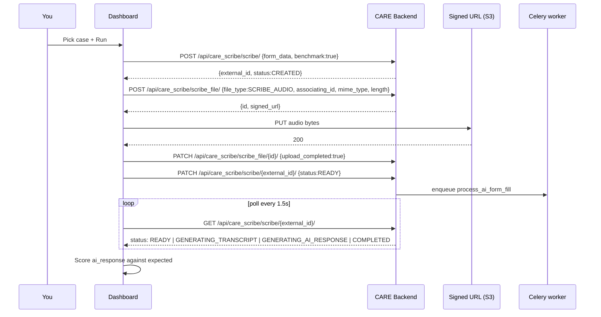

# CARE Scribe Bench

A **standalone GitHub Pages dashboard** for testing and benchmarking the [CARE Scribe](https://github.com/10bedicu/care_scribe) audio-transcription pipeline against any CARE deployment.

The whole app is a single-page React SPA that talks to a CARE backend over HTTPS. It ships pre-recorded audio clips inside the build so you can trigger reproducible scribe runs and score the AI response against a hand-authored ground-truth.

## What it does

Four panels on one page:

| # | Panel | What it does |
|---|-------|--------------|
| 1 | **Backend** | Log in to any CARE backend URL with a superuser account (JWT). |
| 2 | **Frontend** | Edit the backend's `plug_config` so any CARE FE tab loads a chosen `care_scribe_fe` build (`remoteEntry.js`). |
| 3 | **Audio + Play Test** | Pick a test case (random or manually) from the built-in library, preview the audio, optionally override chat/audio models, and run it through the scribe pipeline. |
| 4 | **Quality** | See a per-field diff against expected values (same algorithm as `care_scribe_fe/Benchmark`), keep a run history, export JSON/CSV. |

## Requirements

- **A CARE backend with `care_scribe` installed and configured.** (Chat + audio model creds set on the backend.)
- **A superuser account** on that backend. `care_scribe` restricts `benchmark:true` scribe runs to superusers — everyone else hits the facility/quota/TNC gate.
- **CORS whitelist:** your CARE backend must include this dashboard's origin in `CORS_ALLOWED_ORIGINS`. See [CORS setup](#cors-setup) below.

## Deploy to GitHub Pages

The repo ships with a workflow at `.github/workflows/deploy.yml`. Any push to `main`:

1. Runs `npm ci`
2. Runs `npm run build` (which regenerates `public/test-cases/index.json`)
3. Publishes `dist/` via `actions/deploy-pages`

To enable it:

1. Fork this repo.
2. Repository → **Settings → Pages → Build and deployment → Source: GitHub Actions**.
3. Push to `main`.

The dashboard will be available at `https://<your-user>.github.io/<repo>/`. The Vite `base: "./"` config keeps it path-agnostic, so it works both on `user.github.io/repo/` and on a custom domain.

## CORS setup

The browser is calling the CARE backend from a *different* origin. Add your Pages URL to the backend env:

```env
# In your CARE backend (care/.env or Django settings)
CORS_ALLOWED_ORIGINS=https://<your-user>.github.io,https://care.your-hospital.org
```

Then restart the backend. If a login attempt returns *"Could not reach the backend"* with no HTTP status, it's almost always this.

## Local development

```bash
npm install
npm run dev        # http://localhost:5173
npm run typecheck  # tsc --noEmit
npm run build      # produces dist/
npm run preview    # serves dist/ on 4173
```

## Test cases

Test cases live under `public/test-cases/<case-id>/` and are auto-indexed at build time.

Layout:

```
public/test-cases/
├── sample-vitals/
│   ├── manifest.json
│   └── audio.mp3
└── discharge-summary-01/
    ├── manifest.json
    └── audio.mp3
```

Each `manifest.json` follows this shape:

```jsonc
{
  "name": "Human-readable name",
  "audio": "audio.mp3",
  "mimeType": "audio/mpeg",
  "durationSec": null,          // optional — computed at runtime if null
  "tags": ["vitals", "icu"],
  "notes": "Short prose describing what the case tests.",

  // form_data is sent as-is to POST /api/care_scribe/scribe/. It must match the shape
  // care_scribe expects (groups → fields, each field with an id + schema).
  "form_data": [
    {
      "title": "Vitals",
      "fields": [
        {
          "id": "vital__bp_systolic",
          "friendlyName": "Systolic BP",
          "type": "number",
          "current": null,
          "schema": { /* JSON schema for {value, note} */ }
        }
      ]
    }
  ],

  // Ground truth. Keys must match field ids. Each value is compared against
  // scribe's ai_response using the ported Benchmark scoring algorithm.
  "expected": {
    "vital__bp_systolic": { "value": 120, "note": null }
  }
}
```

Regenerate the index whenever you add or edit a case:

```bash
npm run test-cases:index
```

The generated `public/test-cases/index.json` is gitignored — the CI job (and `npm run build`) always rebuilds it.

## Scoring

Ported from `care_scribe_fe/src/pages/Benchmark.tsx`:

| Situation | Score |
|-----------|-------|
| Exact match | **3** |
| Numeric within 5% | **3** (linear falloff to 0 at 50%) |
| String Levenshtein | `3 × (1 − dist / max(len))` |
| Array of items | greedy per-item similarity, averaged |
| Field missing + expected `null` | **3** (correct absence) |
| Field missing + expected value | **-1** (miss) |
| Field present, not in expected, non-empty | **-1** (hallucination) |

Aggregate: `sum(perField.score) / (fieldCount × 3) × 100%`

## How a run works



## Security notes

- **Credentials never leave the browser.** JWTs are held in `sessionStorage` and cleared on logout.
- **The audio payload is uploaded directly** to whatever presigned URL the CARE backend returned — usually S3.
- **The plug URL you save is executed by any CARE FE that loads it.** The dashboard warns if you enter a URL outside `10bedicu.github.io`, `localhost`, or a subdomain of your CARE host. Only point at builds you trust.
- Run history is stored in `localStorage` for convenience. Use the trash button in the Quality panel to clear it.

## Repo layout

```
scribe-audio/
├── .github/workflows/deploy.yml   GH Pages CI
├── PLAN.md                        Design doc
├── public/
│   ├── favicon.svg
│   └── test-cases/                Audio + manifests (gitignored index)
├── scripts/
│   └── build-test-case-index.mjs  Regenerates index.json
├── src/
│   ├── App.tsx                    Composition + run orchestration
│   ├── main.tsx                   Entry
│   ├── index.css                  Tailwind v4 + theme
│   ├── types.ts                   Shared TS types
│   ├── components/
│   │   ├── BackendPanel.tsx
│   │   ├── FrontendPanel.tsx
│   │   ├── AudioPanel.tsx
│   │   ├── QualityPanel.tsx
│   │   └── ui/                    Hand-rolled shadcn-style primitives
│   ├── hooks/
│   │   ├── use-connection.tsx     Session + CareAPI provider
│   │   └── use-stored-state.ts    Generic local/session storage hook
│   └── lib/
│       ├── care-api.ts            REST client for CARE backend
│       ├── scoring.ts             Ported Benchmark scoring
│       ├── scribe-runner.ts       End-to-end pipeline orchestrator
│       ├── test-cases.ts          Loader for public/test-cases/*
│       └── utils.ts               cn, uuid, duration helpers
└── vite.config.ts                 Vite + Tailwind v4 + @ alias
```

## Troubleshooting

- **"Could not reach the CARE backend"** — CORS. Add this dashboard's origin to `CORS_ALLOWED_ORIGINS` on the backend.
- **403 on scribe create** — the account you logged in with is not a superuser. `benchmark:true` mode requires it.
- **Run polls forever** — the Celery worker isn't running, or chat/audio model credentials aren't set on the backend. Check `care_scribe`'s `ScribePluginConfig`.
- **Score is `−1` for a field that looks correct** — check whether the scribe returns the value wrapped in `{value, note}`. The scorer unwraps that automatically; if your `expected` also uses that shape it will compare correctly.
- **CARE FE doesn't pick up the new plug URL** — the browser caches `remoteEntry.js`. Force-reload the CARE FE tab.

## License

MIT. Scoring logic adapted from [`care_scribe_fe`](https://github.com/10bedicu/care_scribe_fe) (MIT, © 10bedicu).
